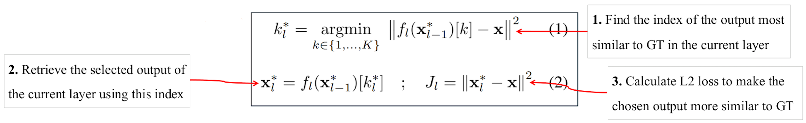
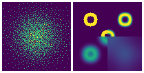

# ICLR 2025 | 全新的生成模型，带来独一无二的能力

我们提出了一种全新的生成模型：离散分布网络（Discrete Distribution Networks），简称 DDN。相关论文已发表于 ICLR 2025。

DDN 采用一种简洁且独特的机制来建模目标分布：

1. 在单次前向传播中，DDN 会同时生成 $K$ 个输出（而非单一输出）。
2. 这些输出共同构成一个包含 $K$ 个等权重（概率均为 $1/K$）样本点的离散分布，这也是“离散分布网络”名称的由来。
3. 训练目标是通过优化样本点的位置，使网络输出的离散分布尽可能逼近训练数据的真实分布。

每种生成模型都有其独特的性质，DDN 也不例外。我们将在后文重点介绍 DDN 的三个特性：

- 零样本条件生成 (Zero-Shot Conditional Generation, ZSCG)
- 树状结构的一维离散潜变量 (Tree-Structured 1D Discrete Latent)
- 完全的端到端可微分 (Fully End-to-End Differentiable)

## 离散分布网络原理
  
*图1：DDN 的重建过程示意图*

首先，我们借助上图所示的 DDN 重建流程作为切入点来一窥其原理。与 diffusion 和 GAN 不同，它们无法重建数据，DDN 能像 VAE 一样实现数据重建：先将数据映射为 latent ，再由 latent 生成与原始图像高度相似的重建图像。

上图展示了 DDN 重建 target 并获得其 latent 的过程。一般 DDN 内部包含多个层级结构，其层数为 $L$，示意图里 $L=3$。但先让我们把目光集中在最左侧的第一层。

**离散分布：** 正如上文所言，DDN 的核心思想在于让网络同时生成 $K$ 个输出，从而表示 “网络输出了一个离散分布”。因此每一层 DDN 都有 $K$ 个 outputs，即一次性输出 $K$ 张不同的图像，示意图中 $K=3$。每个 output 都代表了这个离散分布中的一个样本点，每个样本点的概率质量相等，均为 $1/K$。

**层次化生成：** 我们的目标是让这个离散分布（$K$ 个 outputs），和我们的目标分布（训练集）越接近越好，显然，单靠第一层的 $K$ 个 outputs 无法清晰地刻画整个 MNIST 数据集。第一层获得的 $K$ 张图像更像是将 MNIST 聚为 $K$ 类后得到的平均图像。因此，我们引入“层次化生成”设计以获得更加清晰的图像。

在第一层，橙色 Sampler 根据 $L_2$ 距离从 $K$ 个 outputs 中选出和重建 target 最相似的一张 output。再把被选中的 output 图输入回网络，作为第二层 DDN 的 condition。这样，第二层 DDN 就会基于 condition（被选中的图）生成新的 $K$ 张和 target 更相似的 outputs。接着，从第二层的 outputs 中继续选择出和 target 最相似的一张作为第三层的 condition，并重复上述过程。随着层数增加, 生成的图像和 target 会越来越相似，最终完成对 target 的重建。

**Latent：** 这一路选下来，每一层被选中 output 的 index 就组成了 target 的 latent（图中绿色部分“3-1-2”）。因此 latent 是一个长度为 $L$, 取值范围 $[1,K]$ 的整数数组。

**训练：** DDN 的训练过程和重建过程一样，只需额外在每一层中，对选中的 output 和 target 计算 $L_2$ loss 即可。总的 loss 就是对每一层 $L_2$ loss 取平均。

**生成：** 在生成阶段，将 Sampler 替换为 random choice 即可：每一层从 $K$ 个 outputs 中随机抽取一个作为下一层的 condition。由于生成空间包含 $K^L$ 个样本点，复杂度随 $K$ 和 $L$ 指数级增长，随机采样的 latent 几乎不可能与训练集中的 latent 重合，因此可视为模型生成的新样本。

### 网络结构
将“重建过程示意图”进一步细化，就有下图 (a) 的网络结构图：  
  
*DDN 网络结构示意图和支持的两种网络结构形式*

在图 (a) 中，我们把生成相关的设计整合为 Discrete Distribution Layer(DDL)， 把仅提供基础计算的模块封装为了 NN Block，并重点展示训练时 DDL 内部的数据流。主要关注以下几点：

- 第一层 DDN 的输入为 zero tensor，不需要任何 condition
- DDL 内部通过 $K$ 个 conv1x1 来同时生成 $K$ 个 outputs
- 然后，Guided Sampler 从这些 outputs 中选出和 training image $L_2$ 距离最小的 output
- 被选中的 output 图像承担两项任务：1. concat 回 feature 中，作为下一层 DDL 的 condition。2. 和 training image 计算 $L_2$ loss。

右侧的 (b), (c) 两图分别展示了 DDN 支持的两种网络结构形式:  

- (b) **Single Shot Generator:** 类似 GAN 中生成器的 decoder 结构，但需要在网络中插入足够数量的 DDL 以确保生成空间 $K^L$ 足够大。  
- (c) **Recurrence Iteration:** 各层 DDL 共享相同参数，类似 diffusion 模型，需要做多次 forward 才能生成样本。

出于计算效率考虑，DDN 默认采用具有 coarse-to-fine 特性的 single shot generator 形式。

### 损失函数
DDN 是由 $L$ 层 DDL 组成，以第 $l$ 层 DDL $f_l$ 为例，输入上一层选中的样本 $\mathbf{x}^ * _ {l-1}$，生成 K 个新的样本 $f_l(\mathbf{x}^ * _ {l-1})$， 并从中找出和当前训练样本 $\mathbf{x}$ 最相似的样本 $\mathbf{x}^ * _ l$ 及其 index $k _ {l}^ * $。最后，只在选中的样本 $\mathbf{x}^ * _ l$ 上计算这一层 DDL 的 loss $J _ l$。公式及说明如下：  

其中，$\mathbf{x}^ * _ 0 = \mathbf{0}$ 代表第一层 DDL 的输入为 zero tensor。DDN 的总 loss 就是每一层的 loss $J_l$ 取平均。

### Split-and-Prune 优化算法

若按上文所说，每一层 DDN 都只和 GT 最相似的输出样本上计算 loss，这会导致两个问题：

1. **Dead nodes：** 类似于 VQ-VAE 中的"dead codebooks"，即长期未被选中的输出节点没有获得梯度的机会。 而在生成的时候，这些未被优化过的 dead nodes 仍会以同样的概率被选中并输出糟糕的结果。
2. **概率密度偏移：** 打个比方，一些节点运气好，初始化参数时“出生”在了概率密度高的区域，使其在训练的时候有很大概率被 GT 匹配上。而运气差的节点则“出生”在了低密度区域，意味着其被 GT 匹配上的概率非常低。这造成了训练时，节点与节点之间，被 GT 匹配上的概率极不均匀。然而在生成阶段，节点之间一视同仁，采样概率都是 $1/K$。训练和采样之间出现了巨大的脱节。

受进化论启发，我们针对上述问题提出了 Split-and-Prune 优化算法。Split 操作针对被 GT 频繁匹配的节点，而 Prune 操作则解决"dead nodes"的问题。这些节点类比于进化论中的物种，会分化和灭绝。

在训练过程中，我们会统计每个节点被 GT 匹配到的频率，对于频率过大的节点我们会执行 Split 操作，将该节点克隆为两个新节点，两者各继承旧节点一半的统计频次。而对于被匹配频率过小的节点(dead nodes)，我们对其执行 Prune 操作，直接将其删除。在下图中，通过二维概率密度估计的例子证实了 Split-and-Prune 算法的有效性。  
  
*DDN 做二维概率密度估计:*  
*第二行：由于 dead nodes 和概率密度偏移问题，单纯的梯度下降无法完成拟合。*  
*第三行：搭配了 Split-and-Prune 的梯度下降能有效拟合目标分布。*  
*本实验的具体设置在原论文中的 Figure 17。*

此外，我们还用 GIF 图动态地展示了上述实验中 DDN 的优化过程：  
  
*GIF 详细说明见 [URL](https://discrete-distribution-networks.github.io/2d-density-estimation-gif-with-10000-nodes-ddn.html)，实验代码在 [toy_exp.py](https://github.com/diyer22/sddn?tab=readme-ov-file#-toy-example-for-2d-density-estimation)*

## 实验与特性展示
### 随机采样效果展示  
  
*在人脸数据集上的随机采样效果*

初代 DDN 能勉强建模人脸图像。原论文中还包含了 CIFAR10 和 MNIST 的随机采样效果。

### 更通用的零样本条件生成
我们先描述一下“零样本条件生成”（Zero-Shot Conditional Generation, ZSCG）这个任务：

- 首先，Unconditional 地训练一个生成模型，即训练阶段，模型只见过图像，没有见过任何 condition 信号。
- 在生成阶段，用户会提供 condition，比如 text prompt、低分辨率图像、黑白图像。
- 任务目标：让已经 unconditional 训练好的生成模型能根据 condition 生成符合对应 condition 的图像。
- 因为在训练阶段，模型没见过任何的 condition 信号，所以叫 Zero-Shot Conditional Generation。  
  
*用 Unconditional DDN 做零样本条件生成效果：DDN 能在不需要梯度的情况下，使不同模态的 Condition(比如 text prompt 加 CLIP)来引导 Unconditional trained DDN 做条件生成。黄色框圈起来部分就是用于参考的 GT。SR 代表超分辨率、ST 代表 Style Transfer*

如上图所示，DDN 支持丰富的零样本条件生成任务，其做法和图1中的 DDN 重建过程几乎一样。具体而言，只需把图1 中的 target 替换为对应的 condition，并且，把采样逻辑调整为从每一层的多个 outputs 中选出最符合当前 condition 的那一个 output 作为当前层的输出。这样随着层数的增加，生成的 output 越来越符合 condition。

实际上，图1 中展示的重建过程也是一种以 target 为引导的零样本条件生成过程，因为 target 只影响采样过程，自始至终都没有直接输入网络。

**ZSCG 相关工作：** [SDEdit](https://arxiv.org/abs/2108.01073) 论证了 diffusion 模型也能支持零样本条件生成任务。但是，因为需要在 condition 上添加噪声，SDEdit 的 condition 被限制在了 pixel domain。[FreeDoM](https://arxiv.org/abs/2303.09833) 进一步让 diffusion 能支持 non-pixel domain 的 condition，但依赖判别模型提供梯度，来引导 diffusion 的噪声方向。

而 DDN 只需要判别模型对每个 output 做一次 forward，计算出和当前 condition 的 distance， 再用这个 distance 对 outputs 做筛选即可完成零样本条件生成任务。整个过程中不需要计算任何梯度，仅靠一个黑盒判别模型就能引导网络做零样本条件生成。DDN 是第一个支持如此特性的生成模型。换为更专业的术语描述便是：  
> DDN 是首个支持用纯粹判别模型引导采样过程的生成模型，  
> 某种意义上促进了生成模型和判别模型的大一统。

这也意味着用户能够通过 DDN 高效地对整个分布空间进行筛选和操作。这个性质非常有趣，可玩性很高，个人感觉“零样本条件生成”将会得到广泛的应用。

### Conditional Training
尽管 Zero-Shot Conditional Generation (ZSCG) 作为特色非常有趣，但将 condition 输入网络进行训练有以下好处:

1. Condition 极大限制了生成空间的大小，进而缩减了建模难度，使得网络能够生成更高质量的样本。
2. ZSCG 中，每层 outputs 都需要 transform to condition space，总共运算 $K \times L$ 次，对于那些计算量大的 transform (如 CLIP) 会消耗很多算力。

训练 conditional DDN 非常简单，只需要把 condition 或者 condition 的特征直接输入网络中，网络便自动学会了 $P(X|Y)$。

此外，conditional DDN 也可以和 ZSCG 结合以增强生成过程的可控性，下图的第四/五列就展示了以其它图像为 ZSCG 引导的情况下 conditional DDN 的生成效果。  
  
*Conditional-DDNs 做上色和边缘转RGB任务. 第四、五列展示了以其它图像为引导的情况下，零样本条件生成的效果，生成的图像会在保证符合 condition 的情况下尽可能靠近 guided 图像的色调。*

### Online demo  
  
*DDN 上色 demo 效果.gif*

我们部署了一个用 DDN 做人脸上色任务的在线 demo ([国际网络](https://ddn-coloring-demo.diyer22.com/)、[国内网络](http://113.44.140.251:17860/))。
- Demo 主要展示 DDN 的 Zero-Shot Conditional Generation 能力和 Conditional Training 效果
- 用户可以使用颜色笔划和 CLIP prompt 两种 conditon 来做 ZSCG

### 端到端可微分
DDN 生成的样本对产生该样本的计算图完全可微，使用标准链式法则就能对所有参数做端到端优化。这种梯度全链路畅通的性质，主要体现在两方面：

1. DDN 有个一脉相承的主干 feature，梯度能沿着主干 feature 高效反传。而 diffusion 在传递梯度时，需多次将梯度转换到带噪声的样本空间进行反传。
2. DDN 的采样过程不会阻断梯度，意味着网络中间生成的 outputs 也是完全可微的，不需要近似操作，也不会引入噪声。

理论上，在利用判别模型做 fine-tuning 的场景或着强化学习任务中，使用 DDN 作为生成模型能更高效地 fine-tuning。

### 独特的一维离散 latent 
DDN 天然具有一维的离散 latent。由于每一层 outputs 都 condition on 前面所有的results，所以其 latent space 是一个树状结构。树的度为 $K$，层数为 $L$，每一个叶子节点都对应一个 DDN 的采样结果。  
  
*DDN 的 latent 空间为树状结构，绿色路径展示了图一中的 target 所对应的 latent*

DDN 具有较强的数据压缩能力（有损压缩）。DDN 的 latent 是一列整数(list of ints)，属于高度压缩的离散表征。一个 latent 有 $log_2(K) \times L$ 个 bits 的信息量，以人脸图像实验默认的 $K=512$，$L=128$ 为例，一个样本可以被压缩到 1152 bits。

我们考虑到生成效果和训练效率而选择 $K=512$，如果仅从数据压缩角度考虑，$K$ 设置为 2 并增大 $L$，能更好地平衡表示空间和压缩效率. 我们把 $K=2$ 的 DDN 称为 Taiji-DDN。Taiji-DDN 是首个能够将数据直接转换为具有语义的二进制串的生成式模型。而这个二进制串就代表一颗平衡二叉树上的某个叶子节点。

### Latent 可视化
为了可视化 latent 的结构，我们在 MNIST 上训练了一个 output level 层数 $L=3$，每一层 output nodes 数目 $K=8$ 的 DDN，并以递归九宫格的形式来展示其 latent 的树形结构。九宫格的中心格子就是 condition，即上一层被采样到的 output，相邻的 8 个格子都代表基于中心格子为 condition 生成的 8 个新 outputs。  
  
*Hierarchical Generation Visualization of DDN*
- 每个带有彩色边框的样本都是一个中间生成产物，在它周围一圈九宫格内的八个样本都是以它自己为条件生成的更精细的样本(被相同颜色的框圈起来的范围)。
- 未带彩色边框的样本为最终生成的图像。图像越大，表示其为越早期的生成产物，也意味着图像越模糊。
- 尺寸较大且带有蓝色边框的样本是第一层的 8 个输出，而带有绿色边框的样本是第二层的 $8^2=64$ 个输出。
- 可以观察到，同一个格子内的图像间具有更高的相似性，这源于它们有更多的共同祖先。
- 中间的那张大图是所有生成图像的平均。

我们还提供上图的视频版，以动态地展示 DDN 训练时的优化过程：[BiliBili](https://www.bilibili.com/video/BV11tjdzbEoD/)、[YouTube](https://youtu.be/J4aOdyb7A58)。  
此外，我们也提供 output level 层数 $L=4$ 时 [更细致的 latent 可视化图](https://discrete-distribution-networks.github.io/img/tree-latent.mnist-vis-level4.png)。

## 不足和改进
我个人认为，目前的 DDN 最主要的不足之处包括：

1. $K^L$ 的 latent space 不够大，不足以表示复杂分布：
    - 尽管指数复杂度足以重建保 ID 的人脸图像，但对于 ImageNet 中的自然图像，其复杂度远远不足
    - 一个可能的改进是扩展 $K^L$ 的 latent 空间。大致做法是把一张图分为 N 块 patch，每个 patch 内部都从 K 个 outputs 的对应 patch 中独立选择最优 patch，再把选出的最优 patches 拼为一张完整的图，以作为当前层的输出和下一层的 condition。如此 latent 的空间将会增大至 $(K^ N) ^ L$
    - 另外一个潜在的解决方案是参考 Latent Diffusion，额外添置一个 AutoEncoder 让 DDN 在复杂度更低的 latent 空间做生成建模
2. Split-and-Prune 中的 Prune 操作会持续丢弃训练参数：
    - 尤其是在 scaling up 模型的时候，丢弃经过长期训练过的参数不是明智的做法
    - Split-and-Prune 算法的目标是平衡训练时，各个节点被采样到的频率。这个目标和 Mixture-of-Experts (MoE) models 在训练时候保持 experts 的 load balance 相似，因此，可以采用 [Loss-Free Balancing](https://arxiv.org/abs/2408.15664) 中加 bias 的方式，来平衡各个节点被采样到的频率
3. 在原论文的 limitations and future work 章节有更多的扩展，这里就不一一展开了

## 未来研究方向
以下是我根据现阶段 DDN 的情况，推测未来可能的研究方向，包括 DDN 自身的改进以及适合现阶段 DDN 的任务。但由于个人视野有限，所以很多推测可能并不靠谱

- 通过调参工作、探索实验、理论分析以改进 DDN 自身
    - 做 DDN 的总时长不到三个月，而且大多数时候都是一个人。所以，实验很粗糙，也没精力调参和分析，有大量待完善空间
- Scaling up 到 ImageNet 级别，打造出能实际使用、以零样本条件生成为特色的生成模型
- 把 DDN 应用在生成空间不大的领域，我想了这几个适合的：
    - Condition 自带丰富信息，生成空间复杂度较小的 conditional training 任务，例如图像上色、图像去噪
    - Generative model for discriminative tasks 例如用生成模型来做深度估计、光流估计、位姿估计等
    - Robot Learning 领域，接替 [Diffusion Policy](https://anuragajay.github.io/decision-diffuser/)，[Decision Diffuser](https://arxiv.org/abs/2211.15657) 中的 diffusion 模型
    - 在上述这些领域中，相比 diffusion，DDN 可能有以下优势：
        - 单次 forward 即可获得结果，不需要多步迭代降噪过程
        - 若需要多次采样，比如求 uncertainty，DDN 可以在一次前向传播中直接获得多个结果，而不用做多次独立采样
        - 可以借助 DDN 零样本条件生成的特性，在生成过程中方便地施加各种约束 (constraints) 
        - DDN 支持更高效的 end-to-end 优化，可能更适合和判别模型、强化学习相配合
- 把 DDN 应用在非生成类任务上
    - 比如 DDN 天然支持无监督聚类，或者将其特殊的 latent 应用在数据压缩、相似性检索等领域 
- 用 DDN 的设计思想来改进现有生成模型
    - 比如第一篇引用了 DDN 的工作 [DDCM](https://arxiv.org/abs/2502.01189) 将 DDN 构造一维离散 latent 的思想用在了 diffusion 中
- 和其它生成模型相结合，做到优势互补
    - 和 AutoEncoder 结合：类似于 latent diffusion，让 DDN 在复杂度低的 latent 空间做生成任务
    - 和 GAN 结合：DDN 擅长建模完整分布，但建模不好高频信号，GAN 性质正好相反。且 DDN 长得就像个生成器，还端到端可微，看起来 DDN 和 GAN 的判别器十分般配
- 将 DDN 应用在 LLM 的文本建模任务上
    - 我做了一个初步的尝试，[将 DDN 融入 GPT](https://github.com/Discrete-Distribution-Networks/Discrete-Distribution-Networks.github.io/issues/1)，旨在去掉 tokenizer，并让 LLM 直接建模二进制串。
    - 而且希望在每次前向传播中，模型会根据生成难度自适应调整生成内容的 byte 长度(可以理解为天然支持 speculative sampling)

## 后记
一个有趣的现象是，当我向不同领域的人介绍 DDN 时，很多人会觉得 DDN 与他们领域中的某些概念相似。有人觉得 DDN 像 VQ-VAE，有人觉得像扩散模型，还有人觉得像强化学习，甚至有人认为它类似于 LLM 中的 MoE（混合专家系统）。一个算法能让如此多不同领域的人产生共鸣，实属难得。作为全新的生成模型，DDN 还有许多值得分享的内容，但受篇幅限制，这里就不一一展开了。欢迎感兴趣的读者阅读原论文，或在评论区留言交流。

**arxiv：** https://arxiv.org/abs/2401.00036  
**Project Page：** https://discrete-distribution-networks.github.io/

## 附录：关于 DDN 的常见疑问

Q1: DDN 显存占用会不会很大？  

> DDN 的显存占用只比同架构的 GAN generator 多了一点，几乎没有差别。
>
> 在训练阶段，生成 $K$ 个样本仅用于找出和 GT 最相似的那个样本，而没被选中的 $K-1$ 个样本不会计算梯度，所以在当前层采样完成后，它们会立即释放，不会占用显存。  
> 
> 在生成阶段，提前从 $[1, K]$ 中随机采样一个数作为 index ，只需生成被选择的 index 处的 output，而无需生成其它 $K-1$ 个 outputs，这样既不会占用显存，也不会有额外的计算。

Q2: 会不会有模式塌陷问题?  

> 不会。DDN 会找出和当前 GT 最相似的 output，再用 L2 loss 使其和当前 GT 更加相似，这个操作天然具有 diverse 倾向，能够“撑开”整个生成空间。
>
> 此外，DDN 支持样本重建，原论文中的 Figure 14 展示了 DDN 在测试集上具有良好的重建效果，这意味着 DDN 能够完整地覆盖目标分布。
> 
> DDN 真正的问题不是模式塌陷，而是试图覆盖超出自身复杂度的高维目标分布，从而导致生成模糊的样本。
