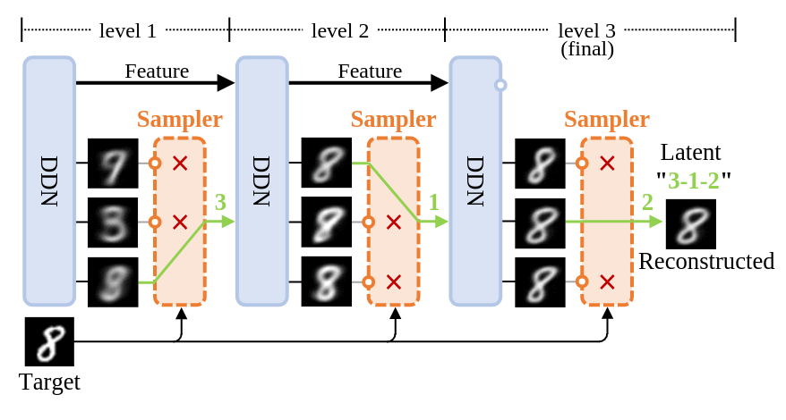
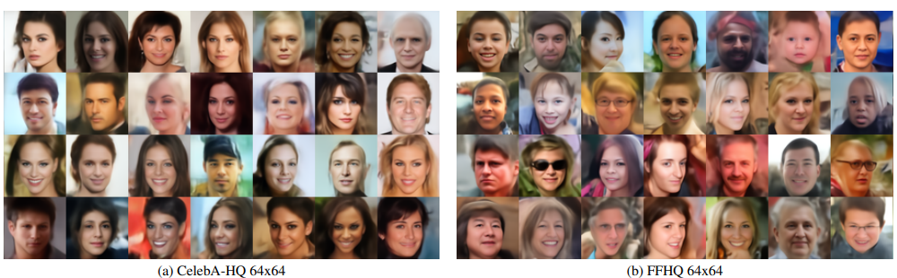
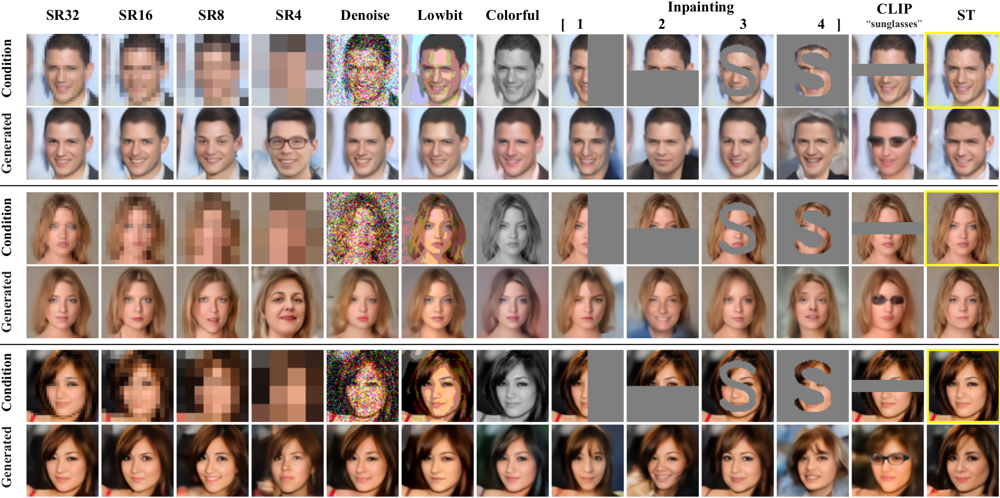

<small>

Chinese version: [中文版](https://zhuanlan.zhihu.com/p/1935903948990047972)

</small>

---

# Discrete Distribution Networks: A Novel Generative Model with Simple Principles and Unique Properties

We propose a brand-new generative model called Discrete Distribution Networks (DDN). The related paper was published at ICLR 2025.

DDN adopts a simple yet fundamentally different approach compared to mainstream generative models for modeling target distributions:

1. The model generates multiple outputs simultaneously in a single forward pass, rather than just one output.
2. It uses these multiple outputs to approximate the target distribution of the training data.
3. These outputs together represent a discrete distribution. This is why we named it "Discrete Distribution Networks".

Every generative model has its unique properties, and DDN is no exception. Here, we highlight three characteristics of DDN:

- Zero-Shot Conditional Generation (ZSCG).
- One-dimensional discrete latent representation organized in a tree structure.
- Fully end-to-end differentiable.

## How Discrete Distribution Networks Work

  
*Figure 1: Illustration of the DDN reconstruction process.*

Let's start with the reconstruction process shown above to understand the core idea of DDN. Unlike diffusion models or GANs, which cannot directly reconstruct data, DDN can reconstruct images similar to a VAE. It encodes data into low-dimensional latent variables and then generates images close to the original input from the latent.

The figure above demonstrates how DDN reconstructs a target and obtains its latent representation. Typically, DDN has multiple layers (denoted as $L$), and in this illustration, we have $L=3$. But first, let’s focus on the first layer (the far-left one).

**Discrete distribution.** As mentioned, the core idea of DDN is to let the network simultaneously generate multiple outputs, which represents a discrete distribution. Each DDN layer thus outputs $K$ images at once (here, $K=3$). Each output represents a sample point from this discrete distribution, with equal probability $1/K$.

**Hierarchical generation.** Our training goal is to make this discrete distribution (the $K$ outputs) as close as possible to the target distribution (training set). Clearly, the first layer alone cannot accurately represent the entire MNIST dataset using only $K$ outputs. Instead, the first layer's outputs resemble clustering the entire dataset into $K$ groups and computing their average images. To generate clearer images, we introduce a hierarchical generation design.

In the first layer, an orange "Sampler" selects the output closest to the target using the $L_2$ distance. The selected output is fed back into the network as the condition for the next layer. The second layer, conditioned on this selected image, generates another set of $K$ outputs that are more similar to the target. This process repeats layer by layer. As the number of layers increases, the generated images become increasingly similar to the target, eventually completing the reconstruction.

**Latent.** The indices of the selected outputs across all $L$ layers form the latent representation (e.g., the green "3-1-2" in Figure 1). Thus, the latent is a list of integers of length $L$, each integer ranging from $1$ to $K$.

**Training.** Training DDN is identical to reconstruction, except that we additionally compute an $L_2$ loss between each selected output and the target at each layer. The total loss is the average of the $L_2$ losses from all $L$ layers.

**Generation.** During generation, we simply replace the Sampler with random choice, randomly selecting one output as the condition for the next layer. Since the entire generation space has $K^L$ sample points, with exponential complexity, when $K$ and $L$ are slightly larger, the generation sample space will be far larger than the training set. Therefore, the randomly sampled latents almost never overlap with the latents in the training set, and can be considered new samples generated by the model.

### Network Architecture

The detailed network architecture is shown in Figure (a) below, which expands on the reconstruction process in Figure 1:  

  
*DDN network architecture and two supported network paradigms.*

In Figure (a), we group the special components related to the generative model into a module called the Discrete Distribution Layer (DDL). The basic computational modules are encapsulated into NN Blocks. The figure emphasizes the data flow within a DDL during training. Here are the key points to notice:

- The first DDN layer takes a zero tensor as input and does not require any condition.
- Inside each DDL, $K$ separate conv1x1 layers simultaneously generate $K$ outputs.
- The Guided Sampler selects the output closest to the training image based on the $L_2$ distance.
- The selected output image serves two purposes:
  1. It is concatenated back into the feature map as the condition for the next DDL layer.
  2. It is used to compute the $L_2$ loss with the training image.

Figures (b) and (c) on the right illustrate two network paradigms that DDN supports:

- (b) Single-shot generator: Similar to the decoder structure in a GAN generator, but it requires inserting enough DDL layers to ensure the generation space ($K^L$) is sufficiently large.
- (c) Recurrence iteration: Different DDL layers share the same parameters, similar to diffusion models. Generating one sample requires multiple forward passes.

For computational efficiency, DDN by default adopts the single-shot generator paradigm, which naturally has a coarse-to-fine generation property.

### Loss Function

The DDN model consists of $L$ DDL layers. For a given layer $l$, denoted as $f_l$, the input is the selected sample from the previous layer, $\mathbf{x}^ * _ {l-1}$. The layer generates $K$ new samples, $f_l(\mathbf{x}^ * _ {l-1})$, from which we select the sample $\mathbf{x}^ * _ l$ that is closest to the current training sample $\mathbf{x}$, along with its corresponding index $k_l^ * $. The loss $J_l$ for this layer is then computed only on the selected sample $\mathbf{x}^ * _ l$. The formula and explanation are as follows:  

Here, $\mathbf{x}^ * _ 0 = \mathbf{0}$ represents the initial input to the first layer. The total loss of DDN is simply the average of losses from all $L$ layers.

### Optimization with Split-and-Prune

Since each DDN layer computes loss only on the output closest to the ground truth (GT), two problems arise:

1. **Dead nodes**: Similar to the "dead codebook" issue in VQ-VAE, some outputs rarely get selected and thus receive little or no gradient updates. During generation, these dead nodes are equally likely to be selected, resulting in poor outputs.
2. **Probability density shift**: Some nodes are "born" in high-density regions by chance and frequently matched with GT, while others are "born" in low-density regions and rarely matched. This creates a mismatch between training (unequal matching probabilities) and sampling (equal probabilities of $1/K$).

Inspired by evolutionary theory, we propose the **Split-and-Prune** optimization algorithm to address these issues. Nodes can be viewed as species in evolution, capable of splitting (diversification) or pruning (extinction). Specifically, during training, we track how frequently each node is matched with GT:

- **Split**: Nodes matched too frequently are split into two new nodes, each inheriting half of the original node's matching frequency.
- **Prune**: Nodes rarely matched (dead nodes) are directly removed.

The effectiveness of the Split-and-Prune algorithm is demonstrated in the following 2D probability density estimation example:

  
*DDN performing 2D probability density estimation:*  
*Second row: Pure gradient descent fails due to dead nodes and probability density shift.*  
*Third row: Gradient descent combined with Split-and-Prune effectively fits the target distribution.*  
*Detailed experimental settings can be found in Figure 17 of the original paper.*

Additionally, we provide a GIF animation to dynamically illustrate the optimization process of DDN for 2D probability density estimation:

  
*A detailed explanation of this GIF can be found [here](https://discrete-distribution-networks.github.io/2d-density-estimation-gif-with-10000-nodes-ddn.html).*  
*The experimental code is available at [toy_exp.py](https://github.com/diyer22/sddn?tab=readme-ov-file#-toy-example-for-2d-density-estimation).*

## Experiments and Property Demonstrations
### Random Sampling Results

  
*Random sampling results on face datasets.*

### Zero-Shot Conditional Generation

We first describe the task of Zero-Shot Conditional Generation (ZSCG):

- First, we train a generative model unconditionally. In other words, during training, the model only sees images and never sees any conditional signals.
- During inference, users provide a condition, such as a text prompt, a low-resolution image, or a noisy image.
- The goal is to have the already trained unconditional generative model produce images that match the given condition.
- Because the model never saw any conditional signals during training, this task is called Zero-Shot Conditional Generation.

  
*Zero-Shot Conditional Generation results using unconditional DDN: DDN can use conditions from various modalities (e.g., text prompts combined with CLIP) to guide generation without computing gradients. The yellow boxes indicate the reference ground truth. SR stands for Super-Resolution, and ST stands for Style Transfer.*

As shown above, DDN supports a wide range of Zero-Shot Conditional Generation tasks. The approach is almost identical to the reconstruction process we described in Figure 1. Specifically, we simply replace the "target" image in Figure 1 with the given condition. Then, at each layer, we select the output that best matches the current condition from the $K$ outputs. As we move through the layers, the generated outputs increasingly match the condition. In fact, the reconstruction process shown in Figure 1 is a ZSCG process guided by a target image. It is important to note that the target image is never directly input into the network. Instead, it shapes the generation outcomes by steering the sampling process.

Previous work, such as [SDEdit](https://arxiv.org/abs/2108.01073), has shown that diffusion models can also support Zero-Shot Conditional Generation. However, SDEdit requires adding noise to the condition, limiting conditions strictly to the pixel domain. [FreeDoM](https://arxiv.org/abs/2303.09833) further enables diffusion models to handle non-pixel domain conditions, but it depends on a discriminative model to provide gradients for guiding the noise direction.

In contrast, DDN only requires a discriminative model to perform a forward pass for each output, computing a distance to the condition. Then, it selects the best output according to this distance—no gradients are needed. Thus, DDN is the first generative model that can be guided purely by a black-box discriminative model without gradient computation. To put it more precisely:  

> DDN is the first generative model whose sampling process can be guided by a pure discriminative model, bridging the gap and unifying generative and discriminative models.

This unique capability allows users to efficiently filter and manipulate the entire distribution space. This property is fascinating and highly versatile. We believe "Zero-Shot Conditional Generation" will find many practical applications in the future.

### Conditional Training

Although Zero-Shot Conditional Generation (ZSCG) is an exciting feature, inputting conditions during model training has several advantages:

1. Conditions significantly reduce the size of the generation space, simplifying the modeling task and allowing the network to generate higher-quality samples.
2. In ZSCG, each layer's outputs must be transformed into the condition space, resulting in a total of $K \times L$ transformations. For computationally expensive transformations (such as computing CLIP embeddings), this can consume substantial computational resources.

Training a conditional DDN is straightforward: simply feed the condition (or its features) into the network. The network will automatically learn the conditional distribution $P(X|Y)$.

Moreover, conditional DDN can be combined with ZSCG to enhance controllability during generation. The fourth and fifth columns in the figure below demonstrate conditional DDN generation guided by other images through ZSCG. The generated images match the given condition while closely following the color tones of the guided images.  
  
*Conditional-DDNs performing colorization and edge-to-RGB tasks. Columns 4 and 5 demonstrate Zero-Shot Conditional Generation guided by other images. The generated images match the given condition while closely following the color tones of the guided images.*

### Online Demo  
  
*DDN Coloring Demo.gif*

We have deployed an online demo that uses DDN for face colorization: [Gradio demo](https://ddn-coloring-demo.diyer22.com/)

- The demo mainly showcases DDN’s Zero-Shot Conditional Generation (ZSCG) capability and the effectiveness of Conditional Training.  
- Users can supply two kinds of conditions for ZSCG: color strokes and/or CLIP prompts.

### End-to-End Differentiable  
Every sample generated by DDN is fully differentiable with respect to the entire computational graph that produced it. This means all parameters can be optimized end-to-end via standard backpropagation. This property of unobstructed gradient flow manifests in two aspects:

1. **Consistent main feature pathway**: DDN has a coherent main feature backbone, enabling gradients to backpropagate efficiently along it. In contrast, diffusion models must repeatedly transform gradients into the noisy sample space for backpropagation.  
2. **Non-blocking sampling process**: The sampling procedure in DDN does not block gradients, meaning intermediate outputs generated by the network are also fully differentiable — no approximation operations are needed, and no extra noise is introduced.

In theory, when fine-tuning with discriminative models or in reinforcement learning tasks, using DDN as the generative model can lead to more efficient fine-tuning.

### Unique 1D Discrete Latent Representation

DDN naturally provides a one-dimensional discrete latent representation. Because each layer's outputs depend on the previously selected outputs, the latent space forms a tree structure. The tree has a branching factor of $K$ and depth $L$, with each leaf node corresponding to a generated sample.

  
*DDN's latent space forms a tree structure. The green path shows the latent corresponding to the target image in Figure 1.*

DDN has strong data compression capabilities (lossy compression). Its latent representation is a list of integers, providing a highly compressed discrete representation. The information content of a latent is $\log_2(K) \times L$ bits. For example, with our default human-face image experiment settings ($K=512, L=128$), each sample can be compressed to just 1152 bits.

In our experiments, we chose $K=512$ for a balance between generation quality and training efficiency. However, from a purely data-compression perspective, setting $K=2$ and increasing $L$ can better balance representation space and compression efficiency. We call this special case "Taiji-DDN." Taiji-DDN is the first generative model capable of directly converting data into semantically meaningful binary strings, where each binary string represents a leaf node in a balanced binary tree.

### Latent Visualization

To visualize the latent structure, we trained a DDN on MNIST with $L=3$ layers and $K=8$ outputs per layer. We visualize the latent tree structure using a recursive 3×3 grid. The center cell of each 3×3 grid is the condition (the selected output from the previous layer), and the surrounding eight cells represent the new outputs generated based on this condition.

In the figure below, each image with a colored border is an intermediate generated sample. The eight images surrounding it are finer samples generated conditioned on it. Images without colored borders are final generated images. Larger images represent earlier (coarser) generation stages. The slightly larger images with blue borders are the first layer's eight outputs, and the green-bordered images are the second layer's $8^2=64$ outputs. Images within the same grid are visually similar due to their shared ancestors. The large central image is the average of all generated images.

  
*Hierarchical Generation Visualization of DDN.*

We also provide a video version of the above visualization, dynamically showing the optimization process during DDN training: [YouTube](https://youtu.be/J4aOdyb7A58).   
Additionally, we offer a more detailed latent visualization with $L=4$ layers [here](https://discrete-distribution-networks.github.io/img/tree-latent.mnist-vis-level4.png).

## Limitations and Possible Improvements

Currently, the main limitations of DDN are as follows:

1. **The size $K^L$ of the latent space may not be large enough to represent highly complex distributions.**  
   While the exponential complexity is sufficient to reconstruct identity-preserving face images, it is still insufficient for more complex natural images like ImageNet.
   - **Possible improvement:** Expand the latent space from $K^L$ to a larger scale. For example, we could divide an image into $N$ patches, independently select the best patch from the $K$ outputs for each patch, and then combine these selected patches into a single image as the condition for the next layer. This would increase the latent space to $(K^N)^L$.
   - Another potential solution is inspired by Latent Diffusion: introduce an additional autoencoder to allow DDN to model distributions in a lower-complexity latent space.

2. **The Prune operation in Split-and-Prune discards trained parameters:**  
   Especially when scaling up, discarding parameters that have been trained for a long time is not ideal.
   - **Possible improvement:** The goal of Split-and-Prune is to balance the frequency with which each node is selected during training. This goal is similar to load balancing in Mixture-of-Experts (MoE) models. Therefore, we could adopt methods like [Loss-Free Balancing](https://arxiv.org/abs/2408.15664) to balance node selection frequencies without discarding parameters.

3. **Additional limitations and future work are discussed in the original paper's "Limitations and Future Work" section.**

## Future Research Directions

Based on the current state of DDN, we speculate on several possible future research directions. These include improvements to DDN itself and tasks suitable for the current version of DDN. Due to my limited perspective, some of these speculations might not be accurate:

- **Improving DDN through hyperparameter tuning, exploratory experiments, and theoretical analysis:**  
  The total time spent developing DDN was less than three months, mostly by a single person. Therefore, experiments were preliminary, and there was limited time for detailed analysis and tuning. There is significant room for improvement.

- **Scaling up to ImageNet-level complexity:**  
  Building a practical generative model with Zero-Shot Conditional Generation as a key feature.

- **Applying DDN to domains with relatively small generation spaces.**  
  - Conditional training tasks where the condition provides rich information, such as image colorization and super-resolution.
  - Generative models for discriminative tasks, such as depth estimation, optical flow estimation, and pose estimation.
  - Robotics applications, where DDN could replace diffusion models in [Diffusion Policy](https://anuragajay.github.io/decision-diffuser/) and [Decision Diffuser](https://arxiv.org/abs/2211.15657) frameworks.
  - In these domains, DDN has advantages over diffusion models:
    - Single forward pass to obtain results, no iterative denoising required.
    - If multiple samples are needed (e.g., for uncertainty estimation), DDN can directly produce multiple outputs in one forward pass.
    - Easy to impose constraints during generation due to DDN's Zero-Shot Conditional Generation capability.
    - DDN is fully [end-to-end differentiable](https://github.com/Discrete-Distribution-Networks/Discrete-Distribution-Networks.github.io/blob/main/blog_en.md#end-to-end-differentiable), enabling more efficient optimization when integrated with discriminative models or reinforcement learning.

- **Applying DDN to non-generative tasks:**  
  - DDN naturally supports unsupervised clustering. And its unique latent representation could be useful in data compression, similarity retrieval, and other areas.

- **Using DDN's design ideas to improve existing generative models:**  
  - For example, the first paper citing DDN, [DDCM](https://arxiv.org/abs/2502.01189), applied DDN's idea of constructing a 1D discrete latent to diffusion models.

- **Applying DDN to language modeling tasks:**  
  - We made an initial attempt to combine [DDN with GPT](https://github.com/Discrete-Distribution-Networks/Discrete-Distribution-Networks.github.io/issues/1), aiming to remove tokenizers and let LLMs directly model binary strings. In each forward pass, the model adaptively adjusts the byte length of generated content based on generation difficulty (naturally supporting speculative sampling).

## Final Thoughts

Interestingly, when we introduce DDN to researchers from different fields, many find similarities between DDN and concepts in their own domains. Some see similarities with VQ-VAE, others with diffusion models, reinforcement learning, or even Mixture-of-Experts (MoE) systems in LLM. It is uncommon for a single algorithm to resonate with researchers from so many different fields. As a novel generative model, DDN has much more to offer; interested readers are encouraged to read the original paper or leave comments for further discussion.

**arXiv:** https://arxiv.org/abs/2401.00036  
**Project Page:** https://discrete-distribution-networks.github.io/

## Common Questions About DDN

Q1: Will DDN require a lot of GPU memory?

> DDN's GPU memory requirements are slightly higher than conventional GAN generator using the same backbone architecture, but the difference is negligible.
> 
> During training, generating $K$ samples is only to identify the one closest to the ground truth, and the $K-1$ unselected samples do not retain gradients, so they are immediately discarded after sampling at the current layer, freeing up memory.
> 
> In the generation phase, we randomly sample an index from ${1,\dots,K}$ and only generate the sample at the chosen index, avoiding the need to generate the other $K-1$ samples, thus not occupying additional memory or computation.

Q2: Will there be a mode collapse issue?

> No. DDN selects the output most similar to the current GT and then uses the $L_2$ loss to make it even more similar to the GT. This operation naturally has a diverse tendency, which can "expand" the entire generation space.
> 
> Additionally, DDN supports reconstruction. Figure 14 in the original paper shows that DDN has good reconstruction performance on the test set, meaning that DDN can fully cover the target distribution.
> 
> The real issue with DDN is not mode collapse but attempting to cover a high-dimensional target distribution that exceeds its own complexity, leading to the generation of blurry samples.

