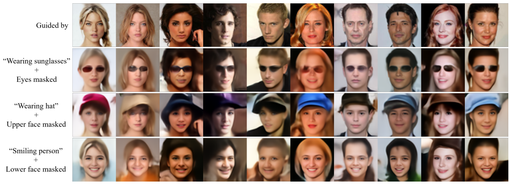

<head>
    <meta charset="UTF-8">
    <title>DDN: Discrete Distribution Networks - Novel Generative Model</title>
    <meta name="description" content="DDN: Discrete Distribution Networks">
    <meta name="keywords" content="DDN, generative model">
</head>

<!-- # Discrete Distribution Networks -->

Discrete Distribution Networks

**A Novel Generative Model with Simple Principles and Unique Properties**

 

[Lei Yang](https://github.com/DIYer22)

### | [Paper]() (Coming soon) | [Code]()(Coming soon)   | [Talk]()(Coming soon)  |

<!-- 
全新的生成模型, 有着简单的原理和独特的性质
- Code 分为
    - sddn 库
    - toy
    - pretrain
    - PPT
    - 中文分享
 -->

 

***Contributions of this paper:***
- We introduce a **novel generative model**, termed Discrete Distribution Networks (DDN), which demonstrates a more straightforward and streamlined principle and form.
- For training the DDN, we propose the **Split-and-Prune optimization algorithm**, and a range of practical techniques.
- We conduct preliminary experiments and analysis on the DDN, showcasing its intriguing properties and capabilities, such as **zero-shot conditional generation** and highly **compact representations**.

 

&nbsp;&nbsp;&nbsp;&nbsp;&nbsp;&nbsp;&nbsp;&nbsp;&nbsp;&nbsp;

 <b>Left:</b> Illustrates the process of image reconstruction and latent acquisition in DDN. Each layer of DDN outputs $K$ distinct images, here $K=3$, to approximate the distribution $P(X)$. The sampler then selects the image most similar to the target from these and feeds it into the next DDN layer. As the number of layers increases, the generated images become increasingly similar to the target. For generation tasks, the sampler is simply replaced with a random choice operation.  
<b>Right:</b> Shows the tree-structured representation space of DDN's latent variables. Each sample can be mapped to a leaf node on this tree.

---

### Abstract

<em>&nbsp;&nbsp;&nbsp;&nbsp;&nbsp;
We introduce a novel generative model, the Discrete Distribution Networks (DDN), that approximates data distribution using hierarchical discrete distributions. We posit that since the features within a network inherently contain distributional information, liberating the network from a single output to concurrently generate multiple samples proves to be highly effective. Therefore, DDN fits the target distribution, including continuous ones, by generating multiple discrete sample points. To capture finer details of the target data, DDN selects the output that is closest to the Ground Truth (GT) from the coarse results generated in the first layer. This selected output is then fed back into the network as a condition for the second layer, thereby generating new outputs more similar to the GT. As the number of DDN layers increases, the representational space of the outputs expands exponentially, and the generated samples become increasingly similar to the GT. This hierarchical output pattern of discrete distributions endows DDN with two intriguing properties: highly compressed representation and more general <b>zero-shot conditional generation</b>. We demonstrate the efficacy of DDN and these intriguing properties through experiments on CIFAR-10 and FFHQ.
</em>

 

<!--  
argmin(|CLIP.image_encode(DDN(z))-CLIP.text_encode("red hat")|) => conditioned_gen
z 属于 K^L

  

 -->

<b>DDN enables zero-shot conditional generation.</b> DDN also supports conditions in non-pixel domains, such as text-to-image with CLIP. Images enclosed in yellow borders serve as the ground truth. The abbreviations in the table header correspond to their respective tasks as follows: “SR” stands for Super-Resolution, with the following digit indicating the resolution of the condition. “ST” denotes Style Transfer, which computes Perceptual Losses with the condition.

---
 

### Overview of Discrete Distribution Networks
 

(a) The data flow during the training phase of DDN is shown at the top. As the network depth increases, the generated images become increasingly similar to the training images. Within each Discrete Distribution Layer (DDL), $K$ samples are generated, and the one closest to the training sample is selected as the generated image for loss computation. These $K$ output nodes are optimized using Adam with the Split-and-Prune method. The right two figures demonstrate the two model paradigms supported by DDN. (b) Single Shot Generator Paradigm: Each neural network layer and DDL has independent weights. (c) Recurrence Iteration Paradigm: All neural network layers and DDLs share weights. For inference, replacing the Guided Sampler in the DDL with a random choice enables the generation of new images.

---
 

### Toy examples for two-dimensional data generation
 

The numerical values at the bottom of each figure represent the Kullback-Leibler (KL) divergence. Due to phenomena such as “dead nodes” and “density shift”, the application of Gradient Descent alone fails to properly fit the Ground Truth (GT) density. However, by employing the Split-and-Prune strategy, the KL divergence is reduced to even lower than that of the Real Samples. 

---
 

### Random samples from DDN trained on face image
 

---

 

### Zero-Shot Conditional Generation guided by CLIP
 

The text at the top is the guide text for that column.

---
 

### Zero-Shot Conditional Generation with Multiple Conditions
 

The DDN balances the steering forces of CLIP and Inpainting according to their associated weights.

---
 

### Conditional DDN performing coloring and edge-to-RGB tasks
 

Columns 4 and 5 display the generated results under the guidance of other images, where the produced image strives to adhere to the style of the guided image as closely as possible while ensuring compliance with the condition. The resolution of the generated images is 256x256.

---
 

### Hierarchical Generation Visualization of DDN
 

We trained a DDN with output level $L = 3$ and output nodes $K = 8$ per level on MNIST dataset, its latent hierarchical structure is visualized as recursive grids. Each sample with a colored border represents an intermediate generation product. The samples within the surrounding grid of each colored-bordered sample are refined versions generated conditionally based on it (enclosed by the same color frontier). The small samples without colored borders are the final generated images. The larger the image, the earlier it is in the generation process, implying a coarse version. The large image in the middle is the average of all the generated images.

