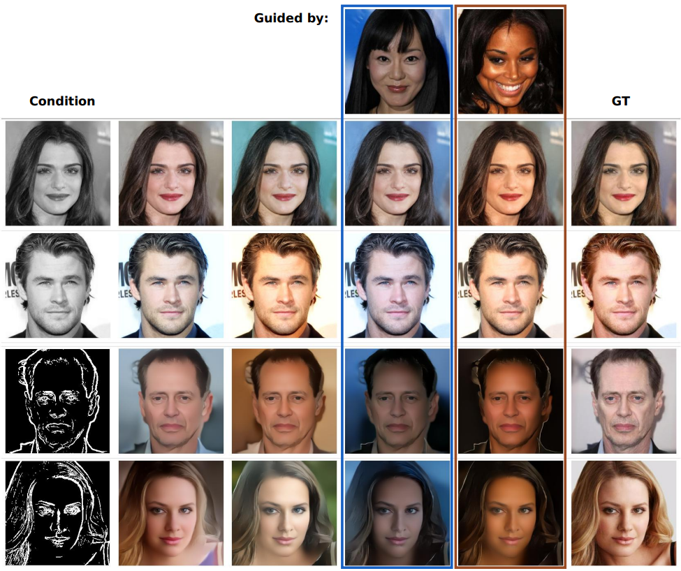
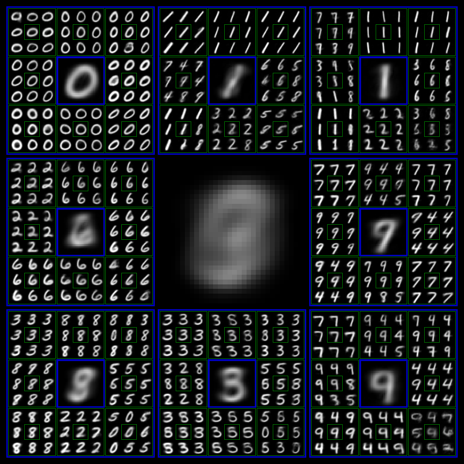

<head>
    <meta charset="UTF-8">
    <title>DDN: Discrete Distribution Networks</title>
    <meta name="description" content="Novel Generative Model with Simple Principles and Unique Properties">
    <meta name="keywords" content="DDN, generative model">
    <meta name="viewport" content="width=device-width, initial-scale=1">
    <meta name="image" content="https://discrete-distribution-networks.github.io/img/ddn-intro.png">
    <meta property="og:title" content="DDN: Discrete Distribution Networks" />
    <meta property="og:description" content="Novel Generative Model with Simple Principles and Unique Properties" />
    <meta property="og:image" content="https://discrete-distribution-networks.github.io/img/ddn-intro.png" />
    <meta name="twitter:card" content="summary_large_image">
    <meta property="twitter:domain" content="discrete-distribution-networks.github.io">
    <meta property="twitter:url" content="https://discrete-distribution-networks.github.io/">
    <meta name="twitter:title" content="DDN: Discrete Distribution Networks">
    <meta name="twitter:description" content="Novel Generative Model with Simple Principles and Unique Properties">
    <meta name="twitter:image" content="https://discrete-distribution-networks.github.io/img/ddn-intro.png">

</head>

🥳 Accepted by **ICLR 2025**  
🚀 The code has been [released](https://github.com/DIYer22/discrete_distribution_networks)  

 <!--    -->

 

<!-- # Discrete Distribution Networks -->

Discrete Distribution Networks

**A novel generative model with simple principles and unique properties**

 

[Lei Yang](https://github.com/DIYer22)  

  
    &nbsp;
  

### [Paper 📄](https://arxiv.org/abs/2401.00036) | [Code 👨‍💻](https://github.com/DIYer22/discrete_distribution_networks) | [OpenReview 💬](https://openreview.net/forum?id=xNsIfzlefG) | [Poster 🖼️](https://github.com/Discrete-Distribution-Networks/Discrete-Distribution-Networks.github.io/issues/2)

<!-- 
全新的生成模型, 有着简单的原理和独特的性质
- Code 分为
    - sddn 库
    - toy
    - pretrain
    - PPT
    - 中文分享
 -->

<!--  -->

Details of density estimation

<!-- 这段 GIF 展示了 DDN 做二维概率密度估计时的优化过程
- 左图：当前能生成的所有样本
- 右图：目标概率密度图
- 为了展示效果，会周期性切换目标概率密度图
  - 目标概率图名称和顺序：`gaussian` -> `blur_circles` -> `QR_code` -> `sprial` -> `words` -> `gaussian` -> `uniform` -> `gaussian` (首尾相同，完成闭环)
- 因此 DDN 也会持续优化参数来拟合新的分布
- 优化器：Gradient Descent with Split-and-Prune
- 这里只展示 1000 nodes 的实验结果，为了更加清晰和全面地展示优化过程，请看 [2D Density Estimation with 10,000 Nodes DDN](2d-density-estimation-gif-with-10000-nodes-ddn.html) 页面
- 实验代码在 [sddn/toy_exp.py](https://github.com/DIYer22/sddn/blob/master/toy_exp.py)，实验环境由 [distribution_playground](https://github.com/DIYer22/distribution_playground) 库提供，欢迎自行把玩 -->

This GIF demonstrates the optimization process of DDN for 2D probability density estimation:
- Left image: All samples that can currently be generated
- Right image: Target probability density map
- For demonstration purposes, the target probability density maps switch periodically. Names and sequence of target probability maps: 
  - `blur_circles` -> `QR_code` -> `spiral` -> `words` -> `gaussian` -> `blur_circles` (same at beginning and end, completing a cycle)
- Therefore DDN continuously optimizes parameters to fit new distributions
- Optimizer: Gradient Descent with Split-and-Prune
- This only shows experimental results with 1,000 nodes; for a clearer and more comprehensive view of the optimization process, see the [2D Density Estimation with 10,000 Nodes DDN](2d-density-estimation-gif-with-10000-nodes-ddn.html) page
- The experiment code is in [sddn/toy_exp.py](https://github.com/DIYer22/sddn/blob/master/toy_exp.py), and the experimental environment is provided by the [distribution_playground](https://github.com/DIYer22/distribution_playground) library, feel free to play with it yourself

 

***Contributions of this paper:***
- We introduce a **novel generative model**, termed Discrete Distribution Networks (DDN), which demonstrates a more straightforward and streamlined principle and form.
- For training the DDN, we propose the **Split-and-Prune optimization algorithm**, and a range of practical techniques.
- We conduct preliminary experiments and analysis on the DDN, showcasing its intriguing properties and capabilities, such as **zero-shot conditional generation without gradient** and **distinctive 1D discrete representations**.

 

&nbsp;&nbsp;&nbsp;&nbsp;&nbsp;&nbsp;&nbsp;&nbsp;&nbsp;&nbsp;

 <b>Left:</b> Illustrates the process of image reconstruction and latent acquisition in DDN. Each layer of DDN outputs $K$ distinct images, here $K=3$, to approximate the distribution $P(X)$. The sampler then selects the image most similar to the target from these and feeds it into the next DDN layer. As the number of layers increases, the generated images become increasingly similar to the target. For generation tasks, the sampler is simply replaced with a random choice operation.  
<b>Right:</b> Shows the tree-structured representation space of DDN's latent variables. Each sample can be mapped to a leaf node on this tree.

 

***[Reviews](https://openreview.net/forum?id=xNsIfzlefG&noteId=h0B0GaonHv) from ICLR:***
> I find the method novel and elegant. The novelty is very strong, and this should not be overlooked. This is a whole new method, very different from any of the existing generative models.

> This is a very good paper that can open a door to new directions in generative modeling.

---
 

### Abstract

<em>&nbsp;&nbsp;&nbsp;&nbsp;&nbsp;
We introduce a novel generative model, the Discrete Distribution Networks (DDN), that approximates data distribution using hierarchical discrete distributions. We posit that since the features within a network inherently capture distributional information, enabling the network to generate multiple samples simultaneously, rather than a single output, may offer an effective way to represent distributions. Therefore, DDN fits the target distribution, including continuous ones, by generating multiple discrete sample points. To capture finer details of the target data, DDN selects the output that is closest to the Ground Truth (GT) from the coarse results generated in the first layer. This selected output is then fed back into the network as a condition for the second layer, thereby generating new outputs more similar to the GT. As the number of DDN layers increases, the representational space of the outputs expands exponentially, and the generated samples become increasingly similar to the GT. This hierarchical output pattern of discrete distributions endows DDN with unique properties: more general zero-shot conditional generation and 1D latent representation. We demonstrate the efficacy of DDN and its intriguing properties through experiments on CIFAR-10 and FFHQ.
</em>

 

<b>DDN enables more general zero-shot conditional generation.</b> DDN supports zero-shot conditional generation across non-pixel domains, and notably, without relying on gradient, such as text-to-image generation using a black-box CLIP model. Images enclosed in yellow borders serve as the ground truth. The abbreviations in the table header correspond to their respective tasks as follows: “SR” stands for Super-Resolution, with the following digit indicating the resolution of the condition. “ST” denotes Style Transfer, which computes Perceptual Losses with the condition.

---
 

### Overview of Discrete Distribution Networks
 

(a) The data flow during the training phase of DDN is shown at the top. As the network depth increases, the generated images become increasingly similar to the training images. Within each Discrete Distribution Layer (DDL), $K$ samples are generated, and the one closest to the training sample is selected as the generated image for loss computation. These $K$ output nodes are optimized using Adam with the Split-and-Prune method. The right two figures demonstrate the two model paradigms supported by DDN. (b) Single Shot Generator Paradigm: Each neural network layer and DDL has independent weights. (c) Recurrence Iteration Paradigm: All neural network layers and DDLs share weights. For inference, replacing the Guided Sampler in the DDL with a random choice enables the generation of new images.

---
 

### Objective function

&nbsp;&nbsp;&nbsp;&nbsp;&nbsp;
The DDN model consists of $L$ layers of Discrete Distribution Layers (DDL). For a given layer $l$, denoted as $f_l$, the input is the selected sample from the previous layer, $\mathbf{x}^*_{l-1}$. The layer generates $K$ new samples, $f_l(\mathbf{x}^*_{l-1})$, from which we select the sample $\mathbf{x}^*_l$ that is closest to the current training sample $\mathbf{x}$, along with its corresponding index $k_{l}^*$. The loss $J_l$ for this layer is then computed only on the selected sample $\mathbf{x}^*_l$.

 

<!-- \begin{equation} \label{eq:k_star}
k_{l}^* = \underset{k \in \{1, \dots, K\}}{\operatorname{argmin}} \; \left\| f_l(\mathbf{x}^*_{l-1})[k] - \mathbf{x} \right\|^2
\end{equation}
\begin{equation} \label{eq:x_star}
\mathbf{x}^*_l = f_l(\mathbf{x}^*_{l-1})[k_l^*] 

\end{equation}
\begin{equation}
J_l = \left\| \mathbf{x}^*_l - \mathbf{x} \right\|^2
\end{equation} -->

Here, $\mathbf{x}^*_0 = \mathbf{0}$ represents the initial input to the first layer. For simplicity, we omit the details of input/output feature, neural network blocks and transformation operations in the equations.

<!-- By recursively unfolding the above equations, we can derive the latent variable $\mathbf{k}^*_{1:L}$ and the global objective function $J$.

\begin{equation} \label{eq:latent}
\mathbf{k}^*_{1:L} = \left[k_1^*, k_2^*, \dots, k_L^*\right] = \left[ \underset{k \in \{1, \dots, K\}}{\operatorname{argmin}} \; \left\| \mathcal{F}([\mathbf{k}^*_{1:l-1}, k])  - \mathbf{x} \right\|^2 \right]_{l=1}^{L}
\end{equation}

\begin{equation} \label{eq:J}
J =  \frac{1}{L} \sum_{l=1}^{L}  \left\| \mathcal{F}(\mathbf{k}^*_{1:l})   - \mathbf{x} \right\|^2
\end{equation}

Here, $\mathcal{F}$ represents the composite function formed from $f_l$, defined as: $\mathcal{F}(\mathbf{k}_{1:l}) = f_l(f_{l-1}(\dots f_1(\mathbf{x}_0)[k_1] \dots)[k_{l-1}])[k_l]$. Finally, we average the L2 loss across all layers to obtain the final loss for the entire network. -->

---
 

### Toy examples for two-dimensional data generation
 

The numerical values at the bottom of each figure represent the Kullback-Leibler (KL) divergence. Due to phenomena such as “dead nodes” and “density shift”, the application of Gradient Descent alone fails to properly fit the Ground Truth (GT) density. However, by employing the Split-and-Prune strategy, the KL divergence is reduced to even lower than that of the Real Samples. 
 For a clearer and more comprehensive view of the optimization process, see the <a target="_blank" href="2d-density-estimation-gif-with-10000-nodes-ddn.html">2D Density Estimation with 10,000 Nodes DDN</a> page.

---
 

### Random samples from DDN trained on face image
 

---

 

### Zero-Shot Conditional Generation guided by CLIP
 

The text at the top is the guide text for that column.

<!-- ---
 

### Zero-Shot Conditional Generation with Multiple Conditions
 

The DDN balances the steering forces of CLIP and Inpainting according to their associated weights.

 -->

---
 

### Conditional DDN performing coloring and edge-to-RGB tasks
 

Columns 4 and 5 display the generated results under the guidance of other images, where the produced image strives to adhere to the style of the guided image as closely as possible while ensuring compliance with the condition. The resolution of the generated images is 256x256.

---
 

### Hierarchical Generation Visualization of DDN
 

We trained a DDN with output level $L = 3$ and output nodes $K = 8$ per level on MNIST dataset, its latent hierarchical structure is visualized as recursive grids. Each sample with a colored border represents an intermediate generation product. The samples within the surrounding grid of each colored-bordered sample are refined versions generated conditionally based on it (enclosed by the same color frontier). The small samples without colored borders are the final generated images. The larger the image, the earlier it is in the generation process, implying a coarse version. The large image in the middle is the average of all the generated images. More detailed visualization of $L = 4$ is presented <a target="_blank" href="img/tree-latent.mnist-vis-level4.png">here</a>. We also provide a video version of the image above, which dynamically showcases the optimization process during DDN training:

    <iframe 
        src="https://www.youtube.com/embed/J4aOdyb7A58" 
        title="YouTube video player" 
        allow="accelerometer; autoplay; clipboard-write; encrypted-media; gyroscope; picture-in-picture; web-share" 
        allowfullscreen>
    </iframe>

<!-- Google tag (gtag.js) -->

