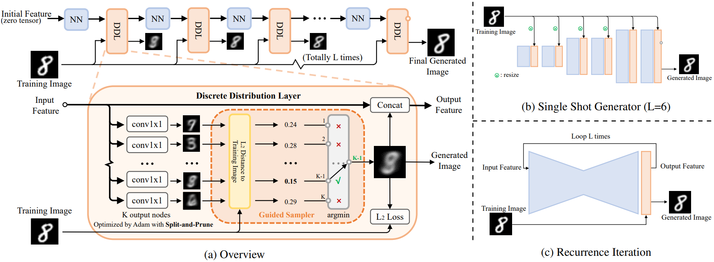

<!-- 

```bash
pandoc wechat_manuscript.md -o 离散分布网络.docx --resource-path=.:./img
```

作者简介：
本文作者杨磊，目前在大模型初创公司阶跃星辰担任后训练算法工程师，其研究领域包括生成模型和语言模型后训练。在这之前，他曾在旷视科技担任六年计算机视觉算法工程师，从事三维视觉、数据合成等方向。他于2018年本科毕业于北京化工大学。
-->


# 全新的生成模型：“离散分布网络”，其原理简单、性质独特

基础生成模型大概有五大类，分别是 ：Energy-Based Model、GAN、Autoregressive、VAE 和 Flow-Based Model。

本项工作提出了一种全新的生成模型：离散分布网络（Discrete Distribution Networks），简称 DDN。相关论文已发表于 ICLR 2025。

DDN 采用一种简洁且独特的机制来建模目标分布：

1. 在单次前向传播中，DDN 会同时生成 $K$ 个输出（而非单一输出）。
2. 这些输出共同构成一个包含 $K$ 个等权重（概率均为 $1/K$）样本点的离散分布，这也是“离散分布网络”名称的由来。
3. 训练目标是通过优化样本点的位置，使网络输出的离散分布尽可能逼近训练数据的真实分布。

每一类生成模型都有其独特的性质，DDN 也不例外。本文将重点介绍 DDN 的三个特性：

- 零样本条件生成 (Zero-Shot Conditional Generation, ZSCG)
- 树状结构的一维离散潜变量 (Tree-Structured 1D Discrete Latent)
- 完全的端到端可微分 (Fully End-to-End Differentiable)


**论文标题：** 《Discrete Distribution Networks》  
**论文链接：** https://arxiv.org/abs/2401.00036  
**项目链接：** https://discrete-distribution-networks.github.io/  
**代码地址：** https://github.com/DIYer22/discrete_distribution_networks  
**发文单位：** 阶跃星辰、旷视科技  

## 离散分布网络原理
  
*图1：DDN 的重建过程示意图*

首先，借助上图所示的 DDN 重建流程作为切入点来一窥其原理。与 diffusion 和 GAN 不同，它们无法重建数据，DDN 能像 VAE 一样具有数据重建能力：先将数据映射为 latent ，再由 latent 生成与原始图像高度相似的重建图像。

上图展示了 DDN 重建 target 并获得其 latent 的过程。一般 DDN 内部包含多个层级结构，其层数为 $L$，示意图里 $L=3$。但先让我们把目光集中在最左侧的第一层。

**离散分布：** 正如上文所言，DDN 的核心思想在于让网络同时生成 $K$ 个输出，从而表示 “网络输出了一个离散分布”。因此每一层 DDN 都有 $K$ 个 outputs，即一次性输出 $K$ 张不同的图像，示意图中 $K=3$。每个 output 都代表了这个离散分布中的一个样本点，每个样本点的概率质量相等，均为 $1/K$。

**层次化生成：** 最终目标是让这个离散分布 ($K$ 个 outputs)，和目标分布（训练集）越接近越好，显然，单靠第一层的 $K$ 个 outputs 无法清晰地刻画整个 MNIST 数据集。第一层获得的 $K$ 张图像更像是将 MNIST 聚为 $K$ 类后得到的平均图像。因此，我们引入“层次化生成”设计以获得更加清晰的图像。

在第一层，橙色 Sampler 根据 $L_2$ 距离从 $K$ 个 outputs 中选出和重建 target 最相似的一张 output。再把被选中的 output 图输入回网络，作为第二层 DDN 的 condition。这样，第二层 DDN 就会基于 condition（被选中的图）生成新的 $K$ 张和 target 更相似的 outputs。接着，从第二层的 outputs 中继续选择出和 target 最相似的一张作为第三层的 condition，并重复上述过程。随着层数增加, 生成的图像和 target 会越来越相似，最终完成对 target 的重建。

**Latent：** 这一路选下来，每一层被选中 output 的 index 就组成了 target 的 latent（图中绿色部分“3-1-2”）。因此 latent 是一个长度为 $L$, 取值范围 $[1,K]$ 的整数数组。

**训练：** DDN 的训练过程和重建过程一样，只需额外在每一层中，对选中的 output 和 target 计算 $L_2$ loss 即可。总的 loss 就是对每一层 $L_2$ loss 取平均。

**生成：** 在生成阶段，将 Sampler 替换为 random choice 即可：每一层从 $K$ 个 outputs 中随机抽取一个作为下一层的 condition。由于生成空间包含 $K^L$ 个样本点，复杂度随 $K$ 和 $L$ 指数级增长，随机采样的 latent 几乎不可能与训练集中的 latent 重合，因此可视为模型生成的新样本。

### 网络结构
将“重建过程示意图”进一步细化，就有下图 (a) 的网络结构图：  
  
*DDN 网络结构示意图和支持的两种网络结构形式*

在图 (a) 中，把生成相关的设计整合为 Discrete Distribution Layer(DDL)， 把仅提供基础计算的模块封装为了 NN Block，并重点展示训练时 DDL 内部的数据流。主要关注以下几点：

- 第一层 DDN 的输入为 zero tensor，不需要任何 condition
- DDL 内部通过 $K$ 个 conv1x1 来同时生成 $K$ 个 outputs
- 然后，Guided Sampler 从这些 outputs 中选出和 training image $L_2$ 距离最小的 output
- 被选中的 output 图像承担两项任务：1. concat 回 feature 中，作为下一层 DDL 的 condition。2. 和 training image 计算 $L_2$ loss。

右侧的 (b), (c) 两图分别展示了 DDN 支持的两种网络结构形式:  

- (b) **Single Shot Generator:** 类似 GAN 中生成器的 decoder 结构，但需要在网络中插入足够数量的 DDL 以确保生成空间 $K^L$ 足够大。  
- (c) **Recurrence Iteration:** 各层 DDL 共享相同参数，类似 diffusion 模型，需要做多次 forward 才能生成样本。

出于计算效率考虑，DDN 默认采用具有 coarse-to-fine 特性的 single shot generator 形式。

### 损失函数
DDN 是由 $L$ 层 DDL 组成，以第 $l$ 层 DDL $f_l$ 为例，输入上一层选中的样本 $\mathbf{x}^ * _ {l-1}$，生成 K 个新的样本 $f_l(\mathbf{x}^ * _ {l-1})$， 并从中找出和当前训练样本 $\mathbf{x}$ 最相似的样本 $\mathbf{x}^ * _ l$ 及其 index $k _ {l}^ * $。最后，只在选中的样本 $\mathbf{x}^ * _ l$ 上计算这一层 DDL 的 loss $J _ l$。公式及说明如下：  


其中, $\mathbf{x}^ * _ 0 = \mathbf{0}$ 代表第一层 DDL 的输入为 zero tensor。DDN 的总 loss 就是每一层的 loss $J_l$ 取平均。

此外，本文还提出了 Split-and-Prune 优化算法来使得训练时每个节点被 GT 匹配上的概率均匀，都是 $1/K$。

下图展示了 DDN 做二维概率密度估计的优化过程：  
  

## 实验与特性展示
### 随机采样效果展示  
  
*在人脸数据集上的随机采样效果*

### 更通用的零样本条件生成
先描述一下“零样本条件生成”（Zero-Shot Conditional Generation, ZSCG）这个任务：

- 首先，Unconditional 地训练一个生成模型，即训练阶段，模型只见过图像，没有见过任何 condition 信号。
- 在生成阶段，用户会提供 condition，比如 text prompt、低分辨率图像、黑白图像。
- 任务目标：让已经 unconditional 训练好的生成模型能根据 condition 生成符合对应 condition 的图像。
- 因为在训练阶段，模型没见过任何的 condition 信号，所以叫 Zero-Shot Conditional Generation。  
  
*用 Unconditional DDN 做零样本条件生成效果：DDN 能在不需要梯度的情况下，使不同模态的 Condition (比如 text prompt 加 CLIP) 来引导 Unconditional trained DDN 做条件生成。黄色框圈起来部分就是用于参考的 GT。SR 代表超分辨率、ST 代表 Style Transfer*

如上图所示，DDN 支持丰富的零样本条件生成任务，其做法和图1中的 DDN 重建过程几乎一样。具体而言，只需把图1 中的 target 替换为对应的 condition，并且，把采样逻辑调整为从每一层的多个 outputs 中选出最符合当前 condition 的那一个 output 作为当前层的输出。这样随着层数的增加，生成的 output 越来越符合 condition。整个过程中不需要计算任何梯度，仅靠一个黑盒判别模型就能引导网络做零样本条件生成。DDN 是第一个支持如此特性的生成模型。换为更专业的术语描述便是：  
> DDN 是首个支持用纯粹判别模型引导采样过程的生成模型，  
> 某种意义上促进了生成模型和判别模型的大一统。

这也意味着用户能够通过 DDN 高效地对整个分布空间进行筛选和操作。这个性质非常有趣，可玩性很高，个人感觉“零样本条件生成”将会得到广泛的应用。

### Conditional Training
训练 conditional DDN 非常简单，只需要把 condition 或者 condition 的特征直接输入网络中，网络便自动学会了 $P(X|Y)$。

此外，conditional DDN 也可以和 ZSCG 结合以增强生成过程的可控性，下图的第四/五列就展示了以其它图像为 ZSCG 引导的情况下 conditional DDN 的生成效果。  
  
*Conditional-DDNs 做上色和边缘转RGB任务. 第四、五列展示了以其它图像为引导的情况下，零样本条件生成的效果，生成的图像会在保证符合 condition 的情况下尽可能靠近 guided 图像的色调。*


### 端到端可微分
DDN 生成的样本对产生该样本的计算图完全可微，使用标准链式法则就能对所有参数做端到端优化。这种梯度全链路畅通的性质，体现在了两个方面：

1. DDN 有个一脉相承的主干 feature，梯度能沿着主干 feature 高效反传。而 diffusion 在传递梯度时，需多次将梯度转换到带噪声的样本空间进行反传。
2. DDN 的采样过程不会阻断梯度，意味着网络中间生成的 outputs 也是完全可微的，不需要近似操作，也不会引入噪声。

理论上，在利用判别模型做 fine-tuning 的场景或着强化学习任务中，使用 DDN 作为生成模型能更高效地 fine-tuning。

### 独特的一维离散 latent 
DDN 天然具有一维的离散 latent。由于每一层 outputs 都 condition on 前面所有的results，所以其 latent space 是一个树状结构。树的度为 $K$，层数为 $L$，每一个叶子节点都对应一个 DDN 的采样结果。  
  
*DDN 的 latent 空间为树状结构，绿色路径展示了图1中的 target 所对应的 latent*

DDN 具有较强的数据压缩能力（有损压缩）。DDN 的 latent 是一列整数(list of ints)，属于高度压缩的离散表征。一个 DDN latent 有 $log_2(K) \times L$ 个 bits 的信息量，以人脸图像实验默认的 $K=512$, $L=128$ 为例，一个样本可以被压缩到 1152 bits。

### Latent 可视化
为了可视化 latent 的结构，我们在 MNIST 上训练了一个 output level 层数 $L=3$，每一层 output nodes 数目 $K=8$ 的 DDN，并以递归九宫格的形式来展示其 latent 的树形结构。九宫格的中心格子就是 condition，即上一层被采样到的 output，相邻的 8 个格子都代表基于中心格子为 condition 生成的 8 个新 outputs。  
  
*Hierarchical Generation Visualization of DDN*  


## 未来可能的研究方向
- 通过调参工作、探索实验、理论分析以改进 DDN 自身，Scaling up 到 ImageNet 级别，打造出能实际使用、以零样本条件生成为特色的生成模型
- 把 DDN 应用在生成空间不大的领域，例如图像上色、图像去噪。又或者 Robot Learning 领域的 Diffusion Policy
- 把 DDN 应用在非生成类任务上，比如 DDN 天然支持无监督聚类，或者将其特殊的 latent 应用在数据压缩、相似性检索等领域 
- 用 DDN 的设计思想来改进现有生成模型，或者和其它生成模型相结合，做到优势互补
- 将 DDN 应用在 LLM 领域，做序列建模任务


